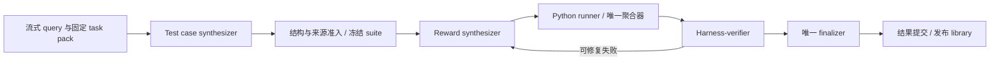

# Reward Harness 当前架构

2026-09-30 统一实现。需求权威为 [当前 PRD](PRD_REWARD_HARNESS_CURRENT.md)，命令见 [README](codebase/reward_harness/README.md)，迁移证据见 [交付记录](codebase/reward_harness/UNIFICATION_DELIVERY.md)。

## 数据流与模块边界

- `driver.py` 管输入遍历、共享资源、单写入器、角色装配、结果提交及适用性筛选。
- `episode.py` 管两个有限合成阶段、各自历史、冻结测例、修订和终止。
- `evaluation/suite.py` 只做结构与来源准入，不运行任务 checker。`evaluation/evaluator.py` 复用 runner、聚合、durable scoring 和报告签名；`verifier.py` 管证据与判断。
- `tools/dispatcher.py` 管三个工具、幂等动作、报告资源和唯一 finalizer；`resources.py` 从当前 ABI 一次生成资源。
- `runtime/worker.py` 执行生成源码，`policy.py` 限制依赖和公开 context，`aggregate.py` 校验结构化返回并只归一化一次。
- `llm/durable.py` 统一请求、预算和响应落盘；两种 HTTP adapter 保留各自 wire 转换；`llm/fixtures.py` 明确隔离人工离线回复逻辑。
- `storage/` 管 canonical hash、blob、journal、结果及累进库；`trace/` 是无请求的派生视图；`compat/reading.py` 原样解释历史序列化对象。

## Reward 和测例

Reward 只接受当前 `rlar.reward.v2` / ABI `v2` / `self_contained_v1`。组件源码独立实现任务解析与评分；verifiable 不调用任务 API，rubric 仅通过原始 judge utility 请求模型并自行解析。允许的通用依赖及具体成员由 `runtime/policy.py` 声明。保存源码、能力、归一化、依赖及运行时契约，全部纳入 canonical key；hash 是内容寻址，不是正确性或适用性证明。

single 为一个组件，checklist 为成功项等权均值。合法 0、执行异常、partial 和全部失败 null 分开记录。只检查最终答案的组件不宣称验证中间推理；重复组件不能增加权重。测例可按能力或 overall 声明范围，组件数量不必与能力数量一致。

Suite 必须先准入冻结，再开始 reward 合成。开发依据可进入合成上下文，执行函数只取得 task pack 许可的 query/response/reference/metadata。禁止明显按候选字符串、ID 或标签查表；静态筛查不保证识别所有记忆或隐蔽绕过。Verifier 判断标签意图与实际行为，冻结和 HMAC 都不证明语义正确性。

## 工具、选择和复用

工具只有 `read_resource`、`test_reward`、`submit_reward`。完整 batch 先校验，独立只读资源可并发，行为测试顺序执行；全部结果形成 barrier 后才能发下一轮合成请求。`test_reward` 默认 `on_pass=submit`，直接走与显式提交相同的 finalizer，省去模型回复“完成”的轮次。

`on_pass=return` 支持先查看再选择。多个合格候选按预声明的 selector metric 和 reward key 排序；没有该 metric 时按 key 稳定打破平局。旧 metric 名仅作候选排序/诊断字段保留，不参与当前验收门槛。只有完整通过当前证据核验的候选可选。

Library 只发布已被结果提交的条目。`compatible_entries` 只筛任务契约、许可输入、模式和运行时；唯一 finalizer 再核验当前 suite、verifier 配置、源码 hash、报告完整性和所有 required 判断。跨 query 或 suite 改变时，旧 passed 不自动有效。没有语义向量检索或跨 run 自动导入。

## 持久化与入口

每次运行至少保存 `run_manifest.json`、`results.jsonl`、`trace.jsonl`、内容寻址 `blobs/`，按结果布局可另有 `reward_library.jsonl`；checkpoint 是缓存，不能覆盖 journal/results 权威。详见 [可靠性](HARNESS_RELIABILITY.md)。

`construct/resume` 只执行当前契约。`score/audit` 从成功冻结产物出发，另建证据运行，使用相同 runner/模型留档和评分底座。历史 `report/export-llm-calls/replay` 原样读取，不运行旧评分代码；所有兼容只在读取边界，主框架没有第二套执行器。

当前 subprocess 有时限、输出限制和进程组清理，仍是同用户行为原型；没有正式文件/网络/标签/密钥隔离。Formal audit 需要 isolated runner，当前 CLI 只可显式产出 prototype audit。未建设 Docker、训练器、任意文件/Bash 工具或生产服务。
