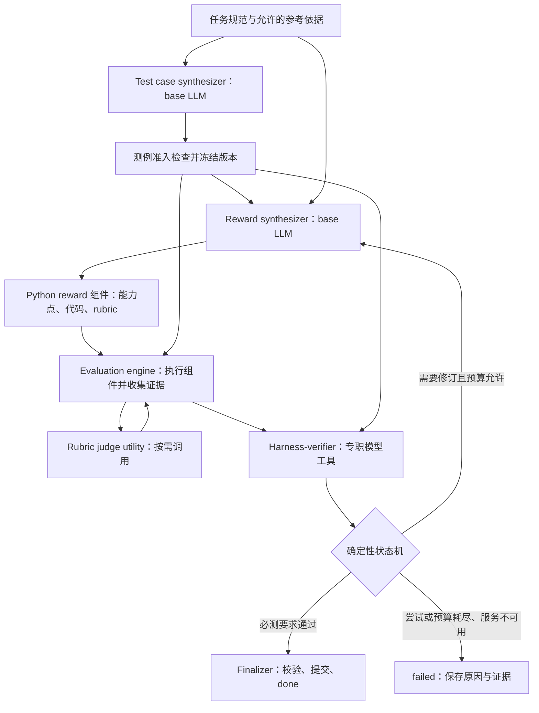

# Reward Harness 更新需求：双合成角色、工具化验收与定向蒸馏

版本：v2.0-draft；日期：2026-09-28。已纳入用户确认：验收工具命名为 harness-verifier；triplet 为三个候选回答的三条两两关系。

状态：开发需求稿，基于当前实现和本轮设计讨论；本文不代表下列功能已经实现或验证。本轮交付仅更新工程需求，不执行代码迁移、真实模型调用或训练。

## 1. 目标、优先级与文档关系

本次更新将 harness 从“合成 reward，并用预先提供的客观测例验证”扩展为：**先合成并冻结测例，再合成 reward；通过专职验收工具检查执行证据，反馈给 reward synthesizer，在有限预算内完成修订。**

核心学习对象是两个 base-model 角色：test case synthesizer 和 reward synthesizer。Harness-verifier、rubric judge 属于固定工具环境，其输出完整留档，但不默认作为被蒸馏模型的监督目标。运行调度和终止由确定性程序管理。

本文是本次更新的需求主文件。与旧文档冲突时，仅在本文明确修改的范围内，以本文为准；未修改的持久化、恢复、只读数据、执行隔离声明等约束继续生效。后续开发不得同时保留两套互相冲突的默认验收标准。

相关旧文档：

- [原始 PRD](PRD_REWARD_HARNESS.md)：作为 v1 已有功能和验收的历史基线。
- [原始设计](HARNESS_DESIGN.md)：沿用流式输入、源码产物、等权聚合等基础约定。
- [LLM 协议](HARNESS_LLM_PROTOCOL.md)、[Trace 规范](HARNESS_TRACE_SPEC.md)：扩展为多调用角色，继续使用统一调用、只追加历史和真实请求留档。
- [恢复规范](HARNESS_RELIABILITY.md)：继续执行有限重试、预算不重置、提交幂等与故障分类。

### 1.1 本次必须达成的结果

1. 两个 synthesizer 的职责、输入输出和学习目标明确，且无需新增通用多 agent 框架。
2. 测例在 reward 合成之前生成并冻结；同一次 reward 修订不改变测例意图、依据或必测范围。
3. Verifiable 和 rubric 统一为带能力描述、数值分数与语言反馈的 Python 评分组件。
4. 默认验收依据测例意图和真实分项行为，由专职 harness-verifier 判断；不要求 bad case 的总分进入固定低分区间。
5. 所有生成、模型请求、工具调用、修订和重试均有上限，且共同受总预算与 deadline 约束。
6. 支持按角色导出两个 synthesizer 的训练数据，排除专职工具模型的监督目标。
7. 保持单一模型调用基础设施、单一执行路径、单一聚合器和单一 finalizer。

### 1.2 本次不扩展的范围

不增加组件权重优化、组合拓扑或强制总分 gate；不增加动态对抗式测例迭代、复杂排序等级、任意 agent 互相委派、通用 planner/router、GUI、分布式调度、模型部署、GRPO/SFT 训练器。Parquet、大库检索、跨 run 库导入、文件/Bash 工具、正式隔离后端等原有独立待办，不捆绑进本次更新。

两种 ranking 形态仅作为明确的实验配置，不建设通用排序搜索系统。语言反馈先作为可导出的产物，不自动启动 policy model 的训练。

## 2. 已确定的产品约定

| 编号 | 约定 |
|---|---|
| U-01 | 两个核心合成角色分别命名为 test case synthesizer、reward synthesizer，均由 base LLM 驱动。 |
| U-02 | 先生成并冻结测例，再合成和修订 reward；首版不交替扩充测例。 |
| U-03 | Pointwise 的 fail/pass 是候选回答在指定能力范围内的标签，不表示代码修复前后的状态。 |
| U-04 | Reward 可为 single 或 checklist；组件可为 verifiable 或 rubric，允许混合。 |
| U-05 | Verifiable 默认通过 Python 单元测试或确定性检查实现；rubric 默认通过已封装 LLM utility 调用指定 judge 模型，并用 Python 解析结果。 |
| U-06 | 分数统一为 [0,1]；展示层可乘以 100。归一化在执行前固定。 |
| U-07 | Checklist 继续对成功执行项等权平均；有效 0 不等于执行失败；全失败为 null。 |
| U-08 | 保存每个 reward 组件的能力点，也保存每条测例的判别目标及判断依据。 |
| U-09 | 默认验收关注分项行为是否体现预期能力差异；bad case 仅影响部分组件、总分只下降 0.1～0.2，可以是合理结果。 |
| U-10 | Harness-verifier 是专职验收工具，可使用小模型，无需接入或训练 base model 的验收能力。 |
| U-11 | 对外合成结果采用 done/failed 语义；失败必须保留质量、预算、验证不可用和服务故障等原因。 |
| U-12 | 总尝试次数默认按 5 次设计，包含首次；重试、恢复和更换 worker 不重置预算。具体限额在 manifest 中固定。 |

本文中的工程默认值可以通过显式运行配置调整；不得由 synthesizer 或验收工具在运行中自行放宽。

## 3. Hierarchy：哪些能力需要被学习

### 3.1 四层职责

| 层级 | 模块 | 是否调用 LLM | 模型定位 | 默认蒸馏目标 |
|---|---|---|---|---|
| L0：任务依据 | 任务规范、能力描述、参考数据、标签依据、实验配置 | 无必需调用 | 外部给定或有来源的依据 | 否 |
| L1：合成能力 | Test case synthesizer | 是 | 教师/base LLM；后续可由学生模型替代 | 是：测例构造、依据描述、结构修订 |
| L1：合成能力 | Reward synthesizer | 是 | 教师/base LLM；后续可由学生模型替代 | 是：组件设计、代码/rubric/解析器生成、利用反馈修订 |
| L2：专职工具 | Harness-verifier | 是，或采用显式的规则基线 | 固定的小模型/专职分类模型，独立会话 | 否 |
| L2：专职工具 | Rubric judge | 是 | 指定 gpt-oss-120b 或具体 DeepSeek 模型等，能力和规模由评分任务决定 | 否 |
| L3：执行设施 | Driver、状态机、Runner、聚合、预算、重试、存储、finalizer | 否 | 确定性代码 | 否 |

“Base model”在本文指承担合成能力、后续拟蒸馏/替换的主体模型，不等同于所有被调用的 LLM，也不等同于下游生成任务回答的 policy model。两个 synthesizer 可以使用同一个 base 模型及两套角色提示和独立历史；不要求两个独立模型权重。

专职工具不属于默认学生训练目标，不意味着这些工具天然准确。小模型能否胜任验收，要在带独立标注的验收判断集上验证；不预先声称二分类输出就等于任务容易。

### 3.2 统一名称，消除旧 controller 的歧义

- 旧文档中的“controller 合成决策”归入 reward synthesizer。
- 旧文档中的 `EpisodeController` 和现有 `episode.py` 的调度责任归入确定性的 synthesis loop，不因此调用 LLM。
- 本文的 **harness-verifier** 只判断证据是否满足固定测例意图。不得规划新测例、改 reward、推进输入 cursor、调预算或提交产物。
- `TrustedEvaluator` 拆清执行与测量职责，作为 evaluation engine 保留。新增 harness-verifier 通过这一入口使用证据，而不是复制一个新的 runner/evaluator。
- Finalizer 是唯一提交入口；harness-verifier 返回判断报告，不能直接宣告文件已提交。

Harness-verifier 实现为有界、无任意工具权限的调用接口即可。无需将其做成具有独立目标、循环和子任务委派能力的第三个 synthesizer。

文档统一使用 `harness-verifier`；Python 标识符、actor 和配置字段使用 `harness_verifier`。新功能不再使用 controller 命名。旧字段如 `controller_logical_calls` 仅用于历史兼容，v2 报告按两个 synthesizer 和专职工具分别计数，不悄悄改变旧字段含义。

### 3.3 最小数据流



测例生成结束以后，test case synthesizer 不参与 reward 修订。Harness-verifier 使用冻结的测例产物，没有权力调用 test case synthesizer 重新出题。

## 4. 两个 synthesizer 的输入与产物

### 4.1 Test case synthesizer

输入：任务规范、允许的参考资料/校验器、能力范围、测例数量和类别配置、预算。首版生成时不读取候选 reward 的代码、分数或修订历史，避免按某个实现制造容易通过的标准。

产物：

1. 有稳定 ID 的能力描述，以及它对应哪项任务要求。
2. 待评分的候选回答，包括正常回答、缺陷回答和偏序比较使用的回答。
3. 每条测例的判别目标、预期行为、fail/pass 标签或偏序关系。
4. 判断依据和来源、适用范围、开发/独立审计划分、required/diagnostic 标记。

测例中的 candidate 是“要交给 reward 评分的回答”。代码任务中，它可以是一段候选程序；用于证明该程序正确与否的输入输出单元测试属于标签依据，两者不得混称。

准入阶段确定性检查 schema、引用、必需类别覆盖、重复、关系矛盾、来源字段及任务权限。客观标签有校验器时实际校验；没有独立证明的 rubric 关系可以按配置接纳为 `model_inferred` 依据，但不能伪装成人工/客观标签。不默认新增一个 LLM 为生成测例反复背书。

来源等级至少区分 `objective_verified / human_annotated / model_inferred`；是否允许某等级进入必测集合由运行前 policy 固定。依据描述和来源完整，不等于其语义一定正确。

通过准入后冻结 suite、依据、类别、必测范围和 digest；无法生成有效 suite 则失败。Reward synthesizer 不得删测例、改标签、改关系、降级 required 或放宽标准。

### 4.2 Reward synthesizer

输入：任务规范、能力范围、允许的 API/模型目录、固定 suite 的资源引用、已有兼容 reward 和当前执行反馈。Suite 就绪后才启动该角色。

产物：完整 reward 定义，包括所有组件的能力描述、源码、rubric、解析逻辑、固定归一化及运行依赖。一次生成可包含全部组件，不按组件数强制拆成多次模型调用。

修订依据是 evaluation engine 和 harness-verifier 返回的真实报告。代码、rubric 或解析函数发生变化都生成新的 reward hash，需重新验证。不能以自然语言“已修好”替代执行。

默认通过测试后自动提交，不额外合成一条“done”的 assistant 回复。沿用 `test_reward` 入口和显式 `submit_reward` 兼容路径，两者均走同一 finalizer。

### 4.3 上下文和标签边界

任务要求、能力说明是可见规范；开发失败的案例、预期行为和依据可以按固定反馈策略向 reward synthesizer 展示，以支持修订。不得将“开发反馈可见”描述成“所有开发标签都不可见”。

生成程序执行时只接收允许的 query/response/reference/metadata，不接收 case ID、预期标签、验收结论或整套数据句柄。禁止把开发样例答案和 ID 写入源码查表。独立 audit 始终不进入两个 synthesizer 的上下文。

### 4.4 最小角色接口

Test case synthesizer 每次返回完整的 `SuiteDraft` 结构化产物；必需资源随角色上下文提供，准入错误作为有界 observation 反馈后再次生成。Draft 使用第 6 节的案例/依据结构，但不包含由模型自行认定的冻结状态或准入签名；suite_digest、admission_report 和冻结状态由程序生成。首版无需为它新增一组文件/Bash 或自由规划工具。

Reward synthesizer 继续通过现有 action envelope 调用 `read_resource/test_reward/submit_reward`。Harness-verifier 是 `test_reward` 内部的验收依赖，不额外开放一个让合成者反复请求判定的平行工具入口。Rubric judge 仅由评分组件通过许可的 utility 调用。

两类合成响应格式不同，但使用同一模型 I/O 底座；不要为了共享代码而强迫 suite draft 包装成 reward action，或为不同角色复制持久化与重试逻辑。

## 5. 统一 reward 表示与执行

### 5.1 组件定义

在现有 `single/checklist` 上升级 schema，不创建另一套平行 reward 类型。组件的规范性字段为：

| 字段 | 含义 |
|---|---|
| `id` | 组件稳定标识；改变内容仍由 hash 区分版本 |
| `kind` | `verifiable` 或 `rubric` |
| `capability_ids` | 所覆盖的任务能力；允许一对多、多对一映射 |
| `criterion` | 该组件究竟检查什么，是给人和模型阅读的功能说明 |
| `source / entrypoint` | Python 源码和唯一执行入口 |
| `normalization` | 冻结的 [0,1] 映射 |
| `required_apis` | 允许使用的 checker 或 LLM utility |
| `judge_spec` | 仅 rubric 使用：模型引用、prompt 模板、输出约定及解析入口 |

Rubric 文本/模板在 `judge_spec` 中只有一份权威内容，通过 context 传给执行代码；不得在配置和 Python 源码中维护两份可独立变化的同名模板。源码实现输入组装、utility 调用和结果解析。

Reward hash 覆盖能力描述、组件内容、judge spec、模型版本/生成参数、归一化和执行契约等影响行为的字段。验证报告另行绑定 suite，不把每条待测回答复制进 reward 定义。

### 5.2 统一返回协议

新 ABI 的组件函数返回结构化对象：

```json
{
  "raw_score": 0.0,
  "feedback": "回答遗漏负号，未通过符号检查。",
  "evidence": [{"kind": "check_result", "detail": "符号检查未通过"}]
}
```

`raw_score` 是解析/检查所得的有限数值；由组件声明的唯一 normalization 映射成最终 `score ∈ [0,1]`。默认 identity，因此最简函数直接返回 0–1 的 raw_score；若生成的解析函数已完成映射，也必须使用 identity，不能二次归一化。`feedback` 是针对当前回答的解释；`evidence` 是有大小上限的结构化辅助记录，可为空。该对象不包含由生成代码自行控制的 `eligible/accepted/status`。

Runner 确定执行状态，聚合器验证数值、执行唯一归一化并计算总分。能力 ID 和功能描述由已冻结组件定义关联，不能相信回复中自报的不同组件身份。现有 v1 scalar ABI 通过版本适配器读取，不能给历史记录补造 feedback。

### 5.3 Verifiable

默认编写 Python 单元测试或确定性检查；候选回答未满足要求是有效低分，默认二值检查映射为 0/1。只捕获约定的“候选未通过检查”结果，不把 reward 自身语法错、导入错、服务故障或未完成执行一律转成 0。

使用多个内部单元测试的客观组件，可声明固定的通过比例映射。该映射属于评分定义，不等同于“整条 bad case 总分必须为 0”的验收规则。

### 5.4 Rubric 与已有 LLM utility

公共调用能力约定为 `call_llm_api(message, model_name)`，从 context 注入。模型别名映射到预先配置的完整 endpoint（含需要的端口/API 路径）、精确模型名称/版本及生成参数。gpt-oss-120b、DeepSeek 均须配置实际标识，不把家族名当作任意可替换模型。

执行流程：组装 rubric message → 调用既有 utility → 获得原始可观察回复 → Python 解析 → 固定归一化 → 返回分数和反馈。解析无效、无有效分数等必须成为显式错误，不能默认给 0 或满分。

调用 utility 按本次约定作为环境提供的能力；这不表示当前子项目已经实现该签名。本次只实现适配边界，不重新开发一套 HTTP 客户端/服务部署。适配层必须接入共享预算和完整 trace；若 utility 有内部重试，必须关闭它，或暴露每个物理 attempt，由唯一重试 owner 管理。无法获得实际请求/响应证据时不得声称完整留档验收通过。

模型选择在实验配置中冻结，不由生成代码根据回答表现自动更换。每个 rubric 组件默认一次单轮 judge 调用；多次采样仅在另一个明确配置中允许，不允许失败后重复采样直到碰巧通过。

### 5.5 等权与重要能力

沿用现有 partial mean；正常得 0 的组件参与均值；执行失败的组件记录 mask/error；全失败返回 null。展示 0–100 不改变内部判断尺度。

重要能力可以拆成多个有区别的子能力并增加组件，仍等权计算；报告组件数量和能力覆盖分布，因为增加组件会增加该能力在均值中的占比。增加验证测例只改变验证覆盖，不改变评分占比。不得以复制同一组件的方式冒充不同能力。

不增加 `weights`、可学习聚合器或强制总分 gate。某个能力未满足时，不要求其他无关组件也返回低分。

## 6. 测例协议与 ranking 配置

### 6.1 统一 suite

新 suite 用唯一的候选回答表加测例引用，避免 pointwise/pairwise 重复存放和重复评分。关键对象如下：

```text
Capability:
  id, description, task_requirement_ref

Example:
  id, query_ref, response, allowed_reference_or_metadata, provenance

TestCase:
  id, kind(pointwise|ranking), capability_ids,
  scope(capability|overall), required(bool),
  example_ids, expected_label(pass|fail|null), relations,
  discrimination_target, expected_behavior,
  justification, evidence_source, evidence_refs

FrozenSuite:
  schema_version, id, version, examples, capabilities, cases,
  generation_config_ref, admission_report_ref, suite_digest
```

`expected_behavior` 解释预期能力差异，不默认生成总分阈值。`relations` 显式记录比较方向，不能仅依赖列表位置。未声明关系不等于相等；同一个回答允许被多条测例引用。

基础版本覆盖负例识别、正例保留和偏序三个检测类别。配置固定各能力的必测要求、数量和诊断范围；允许负例较多，但不能缺少防止“全部拒绝”的正例依据。类别覆盖不是语义正确性的证明。

### 6.2 Required 与 diagnostic

Required 案例的结论决定是否完成；diagnostic 案例用于报告和反馈，不自动阻断完成。类别在 suite 冻结前确定，不能因某个 reward 测试失败而临时调整。所有 diagnostic 失败仍导出，不从报告中消失。

运行时只在“该测例所需的评分证据”完整时进行语义验收。能力级测例通常检查相关组件；整体偏序需要其总分的有效性和 mask 信息。无关组件的 partial 结果不自动导致每条测例失败，也不能被 harness-verifier 用来掩盖必测能力缺少证据。

### 6.3 两种 ranking 形态

用户已确认“3 对”指三个候选回答的三条两两关系，不是三组独立二元比较。

配置固定为 `ranking_layout: pairwise | triplet`：

- `pairwise`：一组两个候选，一条明确的比较关系。
- `triplet`：一组三个候选 a、b、c，声明 a/b、a/c、b/c 三条非重复两两关系；每条关系都必须有依据。

关系可以是明确的优劣或在所测能力上等价，不能强行制造三个严格等级。若三条关系无法可靠确定，测例仍处于未准入状态，应在测例合成预算内重选候选，不能将缺关系的样例算作完整 triplet。这个检查发生在 suite 冻结前，不触发 reward 修订期改题。

Verifiable 的两个错误回答可以同为 0，属于所测能力上的等价关系。等价不是未声明或不知道；检查等价关系与严格偏好之间的一致性，合并等价类后严格偏好不能形成环。数值差及方向作为 harness-verifier 的证据，不把所有关系都变成默认的硬数值 gate。

两个 ranking 条件都记录候选数、实际关系数、组件执行数、judge 请求数和总成本；消融同时报告监督量，不能将更多调用带来的提升全部归于结构。

## 7. 验收：确定性证据 + 专职二分类工具

### 7.1 唯一验收路径

`test_reward` → evaluation engine 执行/收集 → 证据完整性检查 → harness-verifier → 签名报告 → finalizer。

v2 默认不再把旧的总分 FAR/FRR、固定阈值或 ranking accuracy 门槛与 harness-verifier 结论同时相与。旧指标仅作为适用时的诊断或显式规则基线；不能保留两个默认裁判。

确定性检查继续负责 schema、数值有限性、[0,1] 映射、执行是否完成、引用是否真实、suite/reward/model 版本是否匹配。这些不是让小模型判断的任务。

### 7.2 Harness-verifier 的输入

每条测例输入包括：冻结的任务要求、能力范围、判别目标、预期标签/关系及依据；本次候选回答；reward 各组件的功能与覆盖能力；实际分项分数、反馈、总分、mask/error；成对或成组场景中的分数差异。

默认不向 harness-verifier 提供 reward synthesizer 的自我辩护、未来消息或候选源码中的“已通过”声明。生成反馈和候选回答是待评数据，不是 harness-verifier 的新指令。字段引用、上下文大小和输出大小都受限。

不要求组件名与测例能力 ID 完全一一对应。Harness-verifier 可以按功能识别多组件共同实现的能力，但必须引用真实组件及实际观察，不能凭组件名字或语言描述认定功能存在。

### 7.3 输出：有效判断是二分类，无法判断是操作状态

```text
ValidationDecision:
  case_id, reward_key, suite_digest, evidence_digest,
  operation_status(completed|insufficient_evidence|error),
  passed(bool|null), relevant_component_ids,
  evidence_refs, rationale, repair_feedback,
  verifier_model_ref, verifier_prompt_version
```

`completed` 时必须输出布尔 `passed`；另外两种状态为 null，不作为第三个训练标签，也不悄悄映射成通过。小模型完成的是“测例意图是否被执行证据支持”这一专职判断。`rationale/repair_feedback` 用于可追溯和反馈，不要求隐藏推理或完整思维链。

证据引用必须来自本次执行；确定性校验拒绝不存在的组件、篡改的分数和未来/其他版本的结果。报告签名证明来源与完整性，不证明小模型判断必然正确。

### 7.4 三类判定要求

| 测例 | Harness-verifier 必须检查的内容 |
|---|---|
| Failed case | 预期缺陷是否在对应能力的数值评分中体现；允许只影响部分组件，不要求总分降至 0 或固定区间。 |
| Passed case | 满足该能力的回答是否被相关组件错误惩罚；不要求所有无关能力或整体回答满分。 |
| 偏序 case | 在声明的 capability/overall 范围内，实际分项/总分是否体现有依据的相对偏好；不能把局部优势擅自解释为整体优势。 |

仅文字声称识别问题、对应评分完全没有反映，不足以通过负例检测。恒定高分、恒定低分、随机解释、用异常丢弃困难项均须被测试覆盖。没有必要预设总分应下降 0.1 还是 0.2。

偏序在实际结果中相反或无法区分时，harness-verifier 须按固定测例意图说明不满足或证据不足，不能用泛泛解释绕过明确的偏好要求。微小差异、噪声和允许的不变性如何处理写入固定验收提示/配置，不在每轮临时放宽。

### 7.5 最终提交条件

Finalizer 确定性检查：suite 已准入并冻结；artifact 和证据版本相符；required 案例都有完整有效的判断且 passed=true；必测能力没有未解决的证据缺失；报告模型/提示/生成参数与当前配置一致；结果可持久化。

满足后提交。Harness-verifier 无权更改 suite、required 范围、模型配置或预算，也无权直接写入“成功”库条目。诊断项、独立 audit、生产隔离能力分别报告。

### 7.6 可信边界与独立评测

自验证结论受测例覆盖、标签依据、运行隔离和专职 harness-verifier 判断可靠性共同限制。测试合成模型与评分 judge 使用相同模型可能产生相关偏差，两个会话不等于独立真值。

开发完成 `done` 不表示对所有任务正确，不表示 rubric 的客观真理，也不表示正式隔离验收通过。独立 audit 使用冻结 reward，不反馈修订、不参与默认训练样本筛选；没有独立标签时明确报告所用依据。

## 8. 有限迭代、终止与恢复

### 8.1 单任务状态机

```text
VALIDATE_INPUT
  → SYNTHESIZE_TESTS → ADMIT_AND_FREEZE_SUITE
  → REUSE_CHECK / SYNTHESIZE_REWARD
  → EXECUTE → VERIFY → FINALIZE → DONE
                 └─ 需要修订且有预算 → SYNTHESIZE_REWARD

生成/验证/运行无法完成且已达上限 → FAILED(reason)
用户取消、存储故障、未决进程中断 → 保留 CHECKPOINT/INTERRUPTED
```

测试合成有自己的有限结构修订阶段；冻结以后不再因 reward 表现改题。语义测试失败反馈给 reward synthesizer；暂时网络故障重试同一请求；存储/未知实现故障停止外层，不能继续消耗数据。

### 8.2 计数与限额

| 计数 | 草案默认 | 定义 |
|---|---:|---|
| `test_synthesis_attempts` | 5 | 完整 suite 生成/修订机会；首次和非法产物均计入 |
| `reward_synthesis_attempts` | 5 | 完整 reward 生成/修订机会；首次和非法产物均计入 |
| `model_transport_attempts` | 5 | 每个不可变逻辑请求的物理派发次数，包含首次 |
| `verification_format_attempts` | 5 | 固定证据下，处理验收工具不可解析输出的总调用机会；不对有效“不通过”重抽 |
| 其他硬限制 | 必须显式配置 | synthesizer 决策/读工具上限、所有工具调用、测试/组件执行、总模型请求、tokens、deadline、单调用时间和输出量 |

上述是不同资源，不合并成一个含义模糊的 `max_retry`。未生成产物的只读动作也消耗 synthesizer 决策/工具预算，防止绕过产物次数上限。每次候选的新版本重新执行测试；传输重试不增加候选版本数，但每个 physical attempt 扣全局账本。

所有子预算受同一个 run/job 总预算约束，内层上限不是追加免费额度。派发前持久化预留；无响应保留 unknown/可能费用。网络、worker、HTTP utility 和工具封装不得各自叠加不可见重试。

### 8.3 终态

| 情况 | 对外 outcome | reason/行为 |
|---|---|---|
| 所有 required 测例已有充分证据且通过 | done | `validated`；提交当前版本 |
| 套件/模型/验收策略都兼容且旧证据有效 | done | `compatible_reuse`；不伪造新合成调用 |
| 最大 reward 尝试次数用完仍不满足 | failed | `quality_not_met` |
| 无法在限额内生成有效测例 | failed | `test_suite_unavailable` |
| 小模型验收输出持续无效/证据不足 | failed | `verification_unavailable`；保留细分类原因 |
| 服务在有限重试后仍不可用 | failed | `infrastructure_error`；不记作语义质量失败 |
| 总请求、token、时间等预算耗尽 | failed | `budget_exhausted`；若已有同一冻结标准下的完整合格版本，可按预设规则选用它 |

`done` 对应现有持久化 `status=success`，先通过显示/导出映射表达，不建立第二套独立可写状态。v2 缺少测例不作为正常 unvalidated 成功路径；历史 unvalidated 仍可读取。失败草稿保存为诊断产物。

取消和未完成的系统中断不伪装成 done/failed 已完成任务；外部请求的 unknown 状态不能因为任务最终 failed 而消失。

### 8.4 恢复和复用

沿用 journal、blobs、单写者、result commit、checkpoint；增加阶段、actor、冻结 suite、各角色历史和预算引用。恢复只继续未确认完成的动作，不能自动重采样已持久化的有效 harness-verifier 判断。

复用不再仅看旧 reward 的 task/runtime：验证证据还须匹配当前 suite digest、能力范围、验收模型/提示/策略和 judge 配置。新 suite 不兼容时可重用代码候选并重测，但不能沿用旧的 passed。

“零调用复用”报告为零 reward-synthesizer 调用；若测例合成或重新验收实际调用了模型，仍计入整个任务成本。

## 9. 模型配置、Trace 与定向蒸馏

### 9.1 一个模型目录，显式角色路由

只建设一个模型配置目录和统一 LLM 调用基础设施。角色引用目录项，不复制 endpoint、密钥、重试、usage 和 blob 实现。

```yaml
# 配置结构示意，非可直接运行的完整配置。
models:
  base: {model: REQUIRED, revision: REQUIRED, endpoint: REQUIRED}
  verifier: {model: REQUIRED, revision: REQUIRED, endpoint: REQUIRED}
  rubric: {model: REQUIRED, revision: REQUIRED, endpoint: REQUIRED}
roles:
  test_case_synthesizer: base
  reward_synthesizer: base
  harness_verifier: verifier
  rubric_judge: rubric
verification:
  mode: semantic_verifier
  ranking_layout: pairwise  # 或 triplet：三个候选、三条两两关系
  feedback_view: component_scores_and_feedback
```

两个 base 角色允许显式引用不同目录项，便于实验；默认可共享同一项。Rubric judge 和 harness-verifier 不因都叫 judge 就混为一个职责。任何模型不可用均记录真实失败，不自动替换成 base、mock 或其他供应商。

沿用现有 HTTP adapter、durable client、重试账本等底座，解耦“模型请求持久化”和“合成动作 JSON 解析”。请求 transport 可以复用，响应解析根据 actor 的输出协议分派；不得强迫 rubric/验收回复变成 reward-synthesizer action envelope。

### 9.2 必需调用元数据

每个物理调用至少记录 `actor_role, purpose, parent_job_id, role_episode_id, logical_call_id, physical_attempt_id, model_config_ref, input/output refs, completeness, usage, training_target_eligible`。

合成角色、judge utility 和 harness-verifier 均保存实际请求、响应和可观察历史。Rubric/验收模型的 assistant 回复不因 HTTP role 是 assistant 就被当成学生训练目标。

每个 synthesizer 各有只追加历史，角色之间通过显式产物/工具结果传递内容，不共享一个可变对话。验收工具按固定输入执行，默认无跨候选私有记忆。

模型版本、角色提示、请求格式、输出解析版本和生成参数均进入配置指纹。LLM 服务不能提供不可变 revision 时如实记录可观察标识及其限制，不填造一个已固定的版本。

### 9.3 训练目标矩阵

| 产物/消息 | 默认监督处理 |
|---|---|
| Test case synthesizer 的合法生成/修订回复 | 可成为该角色 SFT target |
| Reward synthesizer 的代码、rubric、解析器和合法修订回复 | 可成为该角色 SFT target |
| Rubric judge 的打分/解释回复 | 不成为 base 学生 target |
| Harness-verifier 的判定/修订建议 | 不成为 base 学生 target |
| 工具反馈、执行结果、开发案例和剩余预算 | 按真实可见性进入合成 prompt，loss mask 为 false |
| Driver/finalizer 自动状态变化 | 不伪造 assistant target |
| Policy-facing language feedback | 独立导出视图；不自动作为合成模型 SFT target |

“不训练 judge”不等于删掉它的反馈。学生仍需学习读取工具反馈、修订代码和 rubric；其 prompt 保留当时实际可见的工具结果。Reward synthesizer 写出的 rubric 文本和解析代码属于合成目标，外部 judge 根据该 rubric 生成的判断属于工具输出。

模型身份也不能代替角色过滤：即使两个 actor 恰好使用同一 endpoint 或同一模型权重，只有显式选择的合成角色进入默认 target。

### 9.4 导出筛选和角色成功标准

扩展现有 `export-sft` 的角色筛选，提供两个独立角色数据视图；不再仅靠最终 reward success 选中全部模型回复。

- Test case synthesizer：suite 通过自身准入并冻结、训练 split、真实合法完整且已提交的逻辑回复。后续 reward 失败不自动排除这些样本，避免只学习容易被某个 reward 通过的测例；记录其依据等级，筛选策略可显式收紧。
- Reward synthesizer：开发合成 done 的训练 episode；保留其中合法失败尝试及后续修复，不监督非法/截断/未提交回复。
- Audit 不用于选择训练成功样本。两个角色和所有派生案例按同一 task-family split 绑定，不能逐 call 随机拆分。
- `per_call` 仅监督当前合成回复；`full_trace` 每个角色 episode 单独输出，不能将多角色调用按时间拼成一个伪造会话。已有 `final_program_only` 仅用于 reward 角色，保持派生视图标识。
- 将来训练同一个学生的两种角色能力时，显式指定角色采样比例和提示区分；导出器不静默混合或重复加权。

生成器的成功轨迹是工程筛选，不是测例质量已被客观证明。token-level mask 仍需实际 tokenizer/template 校验；本更新先完成可验证的消息级角色和监督边界，不宣称训练已经完成。

## 10. 消融与独立测量

实验不默认穷举全部配置组合。首批提供以下独立开关，并对每种配置冻结 manifest：

| 轴 | 实验条件 | 保持一致的部分 |
|---|---|---|
| 验收机制 | `semantic_verifier / rule_baseline` | 同一任务、冻结 suite、可比预算和独立评测 |
| 合成反馈 | 分项能力+分数；分项能力+分数+语言反馈 | 默认完整反馈；移除反馈时同步移除合成侧相关资源，不能留旁路 |
| 开发测例类别 | 三类齐全；分别移除 fail/pass/ranking | 在 suite 冻结前定义；最终独立评测仍覆盖三类 |
| Ranking 形态 | pairwise / triplet | 模型、能力范围、其余合成策略；额外报告监督量与调用成本 |

默认 feedback 消融只改变 reward synthesizer 接收的修订信息，验收工具输入保持不变；若研究 harness-verifier 对语言反馈的依赖，另命名为 `verifier_evidence_ablation`，不能混用结果。

规则基线只在具有明确客观比较依据的测例上使用能力级规则，不采用“所有 bad case 总分必须为 0”的错误基线。两个验收 backend 实现同一接口，一次运行只选一个；不同时执行并取更容易通过的结果。不适用于某类任务时报告不适用，不以默认放行补齐。

主要报告：独立评测的缺陷识别、正例保留和排序表现；开发 done 比例；done 后独立评测失败比例；harness-verifier 与独立标注的分歧；修订次数；各角色调用/token/耗时/unknown 费用；组件数量、mask、案例和关系数量。不能仅以更高 done 比例宣称更优。

小模型 harness-verifier 的评估使用独立标注证据集，不通过反复换模型/提示查看最终 audit 来选择结果。若需要模型选择，另用开发集并固定之后再测 audit。

## 11. 开发目标与代码落点

| 目标 | 修改/新增 | 应复用的现有功能 | 完成标准 |
|---|---|---|---|
| D1：v2 数据协议 | 扩展 capability、组件返回、suite、decision/report、actor 元数据 | `schemas.py`、canonical hash、版本化 JSON schema | 新旧版本可区分，历史无损读取，v2 无重复权威字段 |
| D2：两角色编排 | 新增测例生成阶段与冻结；将旧合成 controller 明确为 reward 角色 | `driver.py`、`episode.py`、资源索引、durable history | 测例先于 reward；两个角色独立历史与有限循环 |
| D3：统一组件执行 | 结构化分数/反馈、verifiable 检查、rubric 原始回复解析、utility 适配 | `runtime/worker.py`、runner、aggregate、broker | 两类组件经同一执行/聚合路径，调用可记账和回放 |
| D4：工具化验收 | 增加薄的 `evaluation/verifier.py` 接口；默认小模型 backend | `evaluation/evaluator.py` 负责执行证据，dispatcher/finalizer 负责统一准入 | 支持能力级语义验收；不残留总分阈值默认硬门槛 |
| D5：终止与恢复 | actor/阶段预算、suite checkpoint、reason 分类、复用证据兼容 | 现有 budget/journal/checkpoint/result commit | 恢复不重置预算，不重写 suite，不漏计工具模型 |
| D6：Trace 与训练视图 | 每次调用标明角色；两个独立合成导出；语言反馈视图 | `llm/durable.py`、blobs、`trace/export.py`、replay/report | judge/harness-verifier target 数量为 0，合成历史因果关系完整 |
| D7：实验配置与证据 | 三类测例、两种 ranking、反馈和验收机制消融 | 配置/preflight、CLI、现有 tests/demo | 配置无旁路，独立评测一致，报告成本与真实状态 |

允许按实际代码组织合并小模块，不按表格机械增加目录。优先在现有 `construct/test_reward/score/report/replay/export-sft` 路径扩展，不新增一组功能相同但命名不同的 CLI。

### 11.1 必须删除或迁移的冲突行为

| v1 表述/行为 | v2 处理 |
|---|---|
| 只有一个合成 controller | 两个 base 合成角色；确定性编排和专职验收工具分别命名 |
| DevCase 必须有全局 `is_correct`，ranking 从正负例笛卡尔积推导 | 版本适配为能力范围标签；v2 使用显式关系和判别意图 |
| 只有标量返回 | v2 结构化输出；旧标量仅经 ABI 适配读取 |
| `score_model` 假定服务直接返回数值 | 新 rubric utility 返回原始回复，由生成的解析器处理；旧入口只是兼容 facade |
| FAR/FRR/排序阈值直接决定默认 eligible | v2 默认语义 backend；确定性完整性检查保留，数值基线显式切换 |
| 所有 assistant 回复可能视为同一个 controller 目标 | 使用 actor role 和 role-local episode 选择监督目标 |
| 缺 suite 可作为本流程的 unvalidated 终态 | v2 必须先取得有效 suite，否则 failed；历史结果继续保留 |
| “没有隐含 judge”“开放式 LLM judge 不建设” | 允许本文两种显式专职模型工具，统一预算/trace；仍不允许未声明的隐藏调用 |

历史 run 不原地升级或重新签名；v1/v2 模式明确分开。新 run 使用 v2；原验收矩阵中受语义改变的条目标记 superseded 并链接新条目，不能把旧测试仍通过当作新功能通过。

## 12. 开发顺序

1. **M1：协议与兼容。** 先实现 D1、角色路由字段、旧数据适配和小型固定 fixtures；不调用真实服务。
2. **M2：两类评分与固定套件。** 实现 D3 和 suite 装载/冻结，使用已提供 fixture 打通结构化执行；合成环节暂可 scripted，但必须如实标注。
3. **M3：验收工具与有限修订。** 完成 D4/D5，用可控专职模型 stub 验证证据输入、分支和恢复；实际 Python 评分不能 mock 成恒 PASS。
4. **M4：Test case synthesizer 与角色蒸馏。** 打通 D2/D6 的端到端双角色链路，完成所有角色请求导出和不含 judge target 的检查。
5. **M5：指定真实服务和消融入口。** 使用用户配置的 base、verifier、rubric 服务做小样本联调，再执行 D7；分别报告原型执行、真实服务、任务质量和隔离等级。

每阶段应交付可运行切片及其证据。外部服务缺失时继续完成可独立实现部分，不替换用户模型或将 scripted 路径列为真实通过。

## 13. v2 验收矩阵

| ID | 场景 | 必须观察到的结果 |
|---|---|---|
| UAT-01 | 两个 synthesizer 使用同一 base 模型 | 独立角色/历史/预算引用；不能合并成一个会话 |
| UAT-02 | Reward 开始修订 | Suite 已冻结；尝试更改标签/required/关系被拒绝 |
| UAT-03 | 测例来源不足或结构/关系矛盾 | 准入失败或按固定依据策略处理；不伪造可信标签 |
| UAT-04 | 混合 verifiable/rubric checklist | 同一输出协议与等权聚合；分项反馈可读取 |
| UAT-05 | 错误回答正常未通过单元测试 | 有效 0 分；reward 自身异常单独作为执行错误 |
| UAT-06 | 某一能力缺陷只使总分下降少量 | 对应分项真实体现缺陷时，可由 harness-verifier 判通过，不被总分固定区间误拒 |
| UAT-07 | 正例被无差别惩罚、或所有回答固定高分 | 分别被 pass/fail 必测识别 |
| UAT-08 | 文字说识别问题但实际分数没有体现 | 不凭文字自动通过；结论引用实际评分证据 |
| UAT-09 | 组件拆分方式与测例能力不一一对应 | 可依据功能/分项证据判断；不能仅因 ID 不匹配拒绝 |
| UAT-10 | 能力级偏序与整体偏序 | 使用声明范围；不把局部优势错误要求为总分优势 |
| UAT-11 | 两种 ranking 配置 | Pairwise 为 2 个候选、1 条关系；triplet 为 3 个候选、3 条关系；允许有依据的等价，不制造严格等级 |
| UAT-12 | API 异常、缺分、必测所需组件未执行 | operation_status 非 completed，不得作为拦截成功 |
| UAT-13 | 无关组件 partial | 保留 partial mean/mask；按测例证据范围处理，不做全局自动放行或误拒 |
| UAT-14 | Harness-verifier 引用不存在的分项/错误版本 | 确定性拒绝报告，不能提交 |
| UAT-15 | Harness-verifier 给出有效不通过 | 进入 reward 修订；不对同一证据反复抽判断直至通过 |
| UAT-16 | 合成、格式修复、网络重试达到各自上限 | 有限终止；所有 physical attempts 计入总账 |
| UAT-17 | 连续读工具、不产出 reward | 仍受步骤/工具/deadline 限额，不能无限循环 |
| UAT-18 | 崩溃发生在 suite 冻结/模型响应/验收落盘/提交边界 | Resume 保持原 suite/历史/预算；不重复提交或无故重调用 |
| UAT-19 | 使用已有 reward，但 suite/harness-verifier 配置改变 | 旧代码可候选复用，旧 passed 不能直接复用 |
| UAT-20 | 多角色完整调用导出 | 可展开真实输入输出，包含失败/unknown；不含凭据；观察回放无新请求 |
| UAT-21 | 默认 base 学生训练导出 | 仅两个 synthesizer 可为 target；rubric/harness-verifier targets 为 0 |
| UAT-22 | 同模型承担多个 actor，或工具输出内含 assistant 文本 | 按 actor 过滤，不因模型名/HTTP role/嵌入文本误监督 |
| UAT-23 | Suite 准入成功但 reward 合成失败 | 测例角色按自身成功标准筛选，不被 reward 失败自动删除 |
| UAT-24 | 语言反馈或测例类别消融 | 改变发生在预定边界；资源无等价旁路；独立评测保持完整 |
| UAT-25 | Rule baseline 与 semantic backend | 单一激活 backend；不暗中叠加旧总分门槛或择优裁判 |
| UAT-26 | 真实 judge utility 已封装且内部带重试 | 关闭或逐次暴露重试；记录实际消息与回复，成本不漏记 |
| UAT-27 | Prototype 环境通过开发测例 | 报告仍为原型保证，不宣称正式隔离或普遍正确性 |
| UAT-28 | 历史 v1 数据读取/回放 | 原始字节与意义不变；无新 feedback、标签或成功证据被补造 |

Harness-verifier 的语义判断能力另需小型人工/客观标注的证据集进行真实评估。上述 scripted/契约测试验证工程分支，不能替代模型判断质量验收。生产准入所需误接受率等阈值由任务方配置，未指定时报告实测值，不编造“已经合格”的质量结论。

## 14. 交付物与待明确项

### 14.1 开发交付物

- 可运行的 v2 配置、schema、角色协议与 v1 只读兼容。
- 两类 Python 评分组件、冻结测例和专职验收工具的最小端到端 demo。
- v2 验收结果、角色调用/成本报告、完整请求导出与观察回放报告。
- 两个合成角色的独立 SFT 视图，证明 judge/harness-verifier 不参与默认 loss；语言反馈独立导出。
- 新旧需求对照和简明 README；不同时保留两套默认操作路径。

所有真实实验、调试及 demo 证据放在 `codebase/reward_harness/runs/YYYY_MM_DD_HH_MM_{TaskName}/`；使用 Asia/Shanghai 起始时间和 PascalCase，历史证据不覆盖。训练源文件只读，采样记录来源、行号、seed 和文件指纹。凭据仅运行时注入。

### 14.2 尚待明确但不阻塞共同协议开发的事项

1. Base、verifier、rubric 的具体模型版本和服务配置：由实际运行提供，不在本文指定一个未经用户选择的小模型。
2. 各任务的必测能力、案例数量、认可的标签依据等级，以及 harness-verifier 质量评估门槛：由 task pack/实验配置固定；harness 不在运行中学习或修改这些标准。

以上配置缺失时，preflight 一次列出缺项。开发可先使用明确标注的离线 fixtures 完成协议和故障测试；真实服务与研究结论分别验收。
